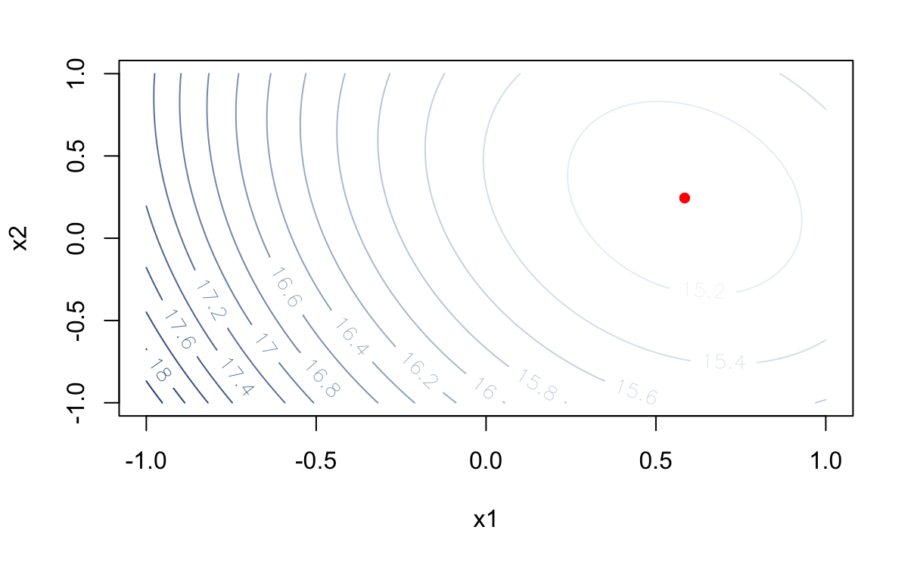
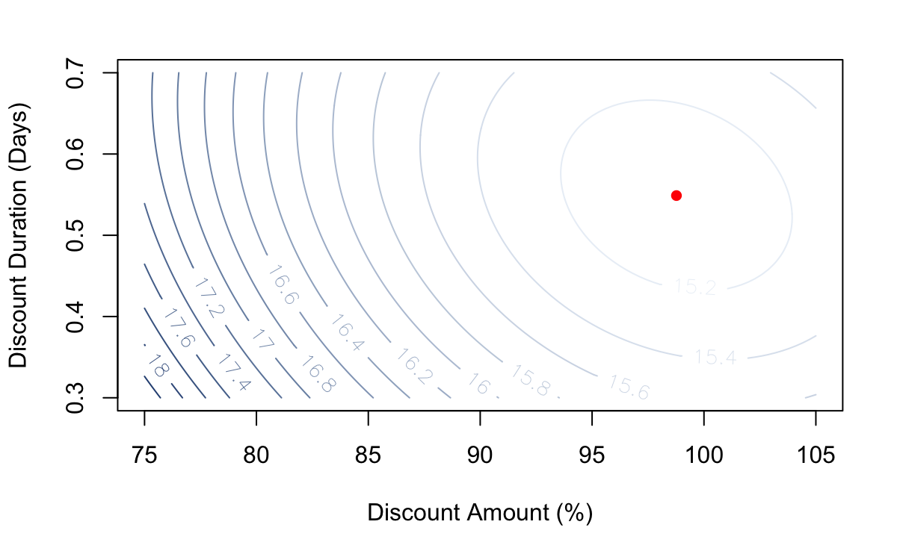

# Optimization-using-RSM
## Introduction
Netflix is an American technology and media services provider. The layout of Netflix's homepage follows a grid system, where different categories are displayed as tiles. Upon hovering the mouse cursor over a tile, a larger preview automatically appears. As more options are presented, users may experience difficulty in making decisions, a phenomenon referred to as decision paralysis. The experiment focuses on the browsing time on Netflix's homepage as a metric of interest, aiming to minimize it and optimize the homepage. Factors of interest include Preview Length, Preview Size, and Tile Size. The experiment aims to determine the optimal combination of these factors that results in the lowest average browsing time.

Response Surface Methodology (RSM) can aid in constructing a surface that represents the relationship between the factors and the Metric of Interest. It aims to characterize the relationship between the expected response and the active factors. RSM emphasizes sequential and effective experimentation, enabling future experiments to be informed by the knowledge gained in previous ones. The primary goals of RSM are to assist in finding the optimum point and identifying the location that yields the minimum browsing time.

## Factor Screening
There are three factors in this design. If $2^{K-p}$ design is used, then the alias will be $factor_3=factor_1*factor_2$. This approach may not be suitable in this context, as it is highly likely that the 2-way interaction effect is significant. Although sacrificing efficiency, the objective is to attain a higher level of accuracy. To determine which factors have a significant influence on the response, a $2^K$ factorial design will be employed.
Build the model `model=lm(y~Prev.Length*Prev.Size*Tile.Size,data=data)` 

## Steepest Descent Method
Perform a curvature test using two active factors. If the test yields a significant result for the pure quadratic effect ($\beta_{PQ}$), proceed directly to phase 3. However, if $\beta_{PQ}$ proves to be non-significant, indicating that the optimum point has not been approached, the steepest descent method will be utilized.
```
## Calculate the average browsing time in each of these conditions and find the 
## condition that minimizes it
pstd.means <- aggregate(netflix.ph2$Browse.Time, 
                        by = list(Prev.Length = netflix.ph2$Prev.Length, 
                                  Prev.Size = netflix.ph2$Prev.Size), 
                        FUN = mean)

pstd.cond2 <- data.frame(Step = 0:8, rbind(step0, step1, step2, step3, step4, step5, step6,step7,step8),ABT=pstd.means$x)
pstd.cond2

plot(x = 0:8, y = pstd.means$x,
     type = "l", xlab = "Step Number", ylab = "Average Browsing Time")
points(x = 0:8, y = pstd.means$x,
       col = "red", pch = 16)
```

<figure class='third'>
  
  
  
</figure>

## Response Optimization
A central composite design (CCD) will be employed to determine the stable point. The table below outlines the conditions that will be input into the simulator. The two-level factorial conditions, as well as the center point, will be derived from phase 2. The axial conditions to be used will be represented by $a=\sqrt{K}$, as this ensures that the estimation of the response surface at each condition is equally precise.
Build the model and visualize it
```
##Fit the full 2nd-order response surface
model <- lm(y ~ Prev.Length + Prev.Size + Prev.Length*Prev.Size + I(Prev.Length^2) + I(Prev.Size^2), data = lyft)
summary(model)

## Let's visualize this surface:
beta0 <- coef(model)[1]
beta1 <- coef(model)[2]
beta2 <- coef(model)[3]
beta12 <- coef(model)[6]
beta11 <- coef(model)[4]
beta22 <- coef(model)[5]
grd <- mesh(x = seq(convert.N.to.C(U = 75, UH = 105, UL = 75), 
                    convert.N.to.C(U = 105, UH = 105, UL = 75), 
                    length.out = 100), 
            y = seq(convert.N.to.C(U = 0.4, UH = 0.6, UL = 0.4), 
                    convert.N.to.C(U = 0.6, UH = 0.6, UL = 0.4), 
                    length.out = 100))
x1 <- grd$x
x2 <- grd$y
eta.so <- beta0 + beta1*x1 + beta2*x2 + beta12*x1*x2 + beta11*x1^2 + beta22*x2^2
```

<figure class='half'>
  
  
  
</figure>

